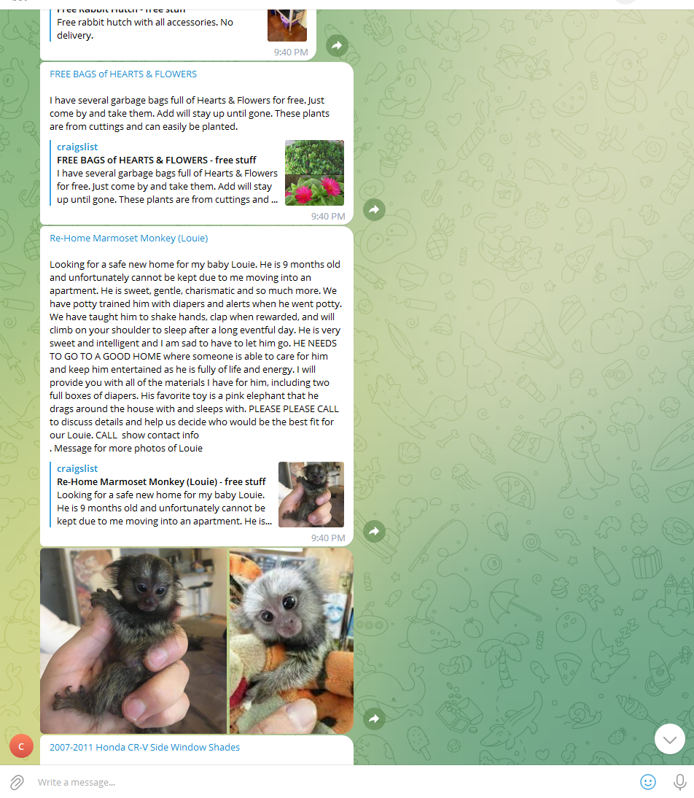

# craigslist-to-telegram

Get updates from [Craig's list free stuff section](https://sfbay.craigslist.org/search/zip) to your telegram account every 10 minutes.



# Required

1. Running instance of [Huginn](https://github.com/huginn/huginn)
2. [Telegram](https://telegram.org/) account and a [Telegram bot](https://core.telegram.org/bots/tutorial)
3. [PhantomJS](https://phantomjscloud.com/) cloud account

# Installation Guide

## Step 1: Deploy Huginn

1. Install Docker using the [install instructions](https://docs.docker.com/get-docker/)
2. Start your Huginn container using
   ```
   docker run -it -p 3000:3000 ghcr.io/huginn/huginn
   ```
3. Open Huginn in the browser http://localhost:3000
4. Log in to your Huginn instance using the username `admin` and password `password`

Huginn installation could be a bit tricky. Here are a couple of well written guides in case you encounter any problems:

1. [https://github.com/huginn/huginn/blob/master/doc/docker/install.md](https://github.com/huginn/huginn/blob/master/doc/docker/install.md)
2. [https://geek-cookbook.funkypenguin.co.nz/recipes/huginn/](https://geek-cookbook.funkypenguin.co.nz/recipes/huginn/)
3. [https://www.linode.com/docs/guides/monitor-your-website-changes-with-huginn-agents/](https://www.linode.com/docs/guides/monitor-your-website-changes-with-huginn-agents/)

## Step 2: Create PhantomJS account

We need a PhantomJS account to render the Craig's list gallery page in the background. The Free Tier of PhantomJS allows to render 500 Pages a day which is more than enough for our purpose.

1. Create a PhantomJS account
2. Copy the PhantomJS ApiKey
3. Log in into your huginn instance and create huginn credentials `phantomjs_apikey`. Use your PhantomJS ApiKey from step 2. The name `phantomjs_apikey` should match the credentials name used in `craigslist-to-telegram.json`.

## Step 3: Create a Telegram Bot

1. Follow these [instructions](https://gideonwolfe.com/posts/sysadmin/huginn/telegram/)

2. Log in into your huginn instance and create huginn credentials `telegram_auth_token` and `telegram_chat_id` from the previous step. if you change the name of the credentials, you need to change it in `craigslist-to-telegram.json` as well. They must match.

## Step 4: Edit `craigslist-to-telegram-scenario.json`

You will need:

1. `Craig's List Free Stuff URL` for your region. You can also specify a region using the map feature on Craig's List website. For instance, here is the URL for a small area from San Francisco:

   `https://sfbay.craigslist.org/search/san-francisco-ca/zip?lat=37.7419&lon=-122.4361&search_distance=2.1#search=1~gallery~0~0`

   Replace the URL with your own.
2. If you changed the name of the credentials in previous steps, you need to change them here as well.

## Step 5: Import `craigslist-to-telegram-scenario.json` into huginn
Log in into your huginn instance and go to "Scenarios" in the main menu. Click on "Import Scenario" and choose the `craigslist-to-telegram-scenario.json` you edited in the previous step.

## Step 6: Run the scenario
Go to "Scenarios" and click on "Craigslist Free Stuff Updates To Telegram". Find the agent "▶ ▶ ▶ Craigslist Free Stuff in Phoenix render PhantomJS" and click "Run" from the "Actions" menu.

From now on, you will get updates every 10 minutes to your telegram account.

# Credits
Thanks to Andrew Cantino for Huginn: https://github.com/huginn/huginn

Great guides provided by:

1. https://gideonwolfe.com/
2. https://www.linode.com/
3. https://geek-cookbook.funkypenguin.co.nz/
